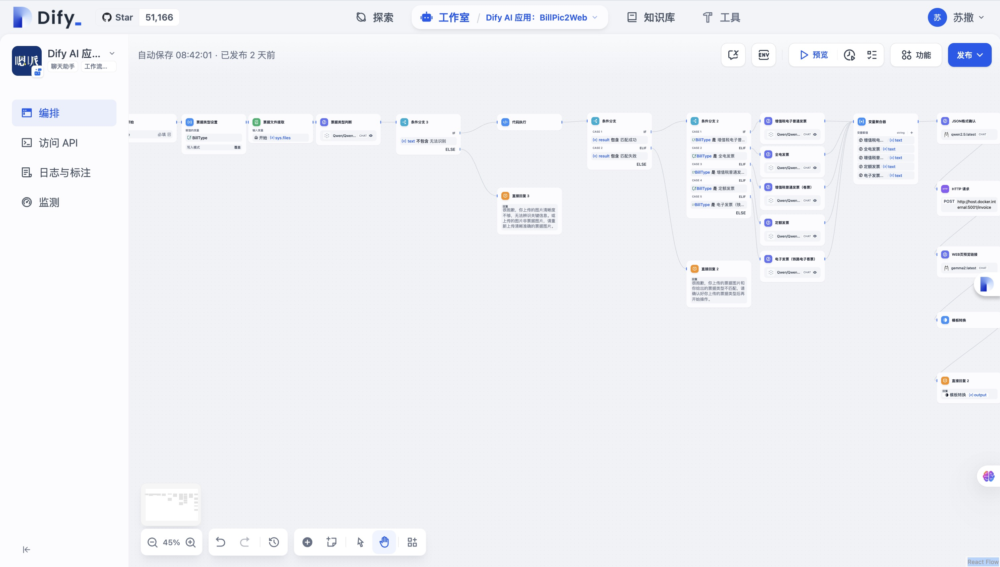
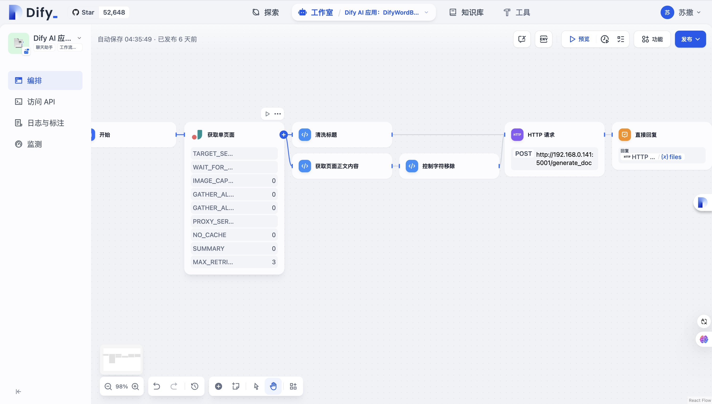
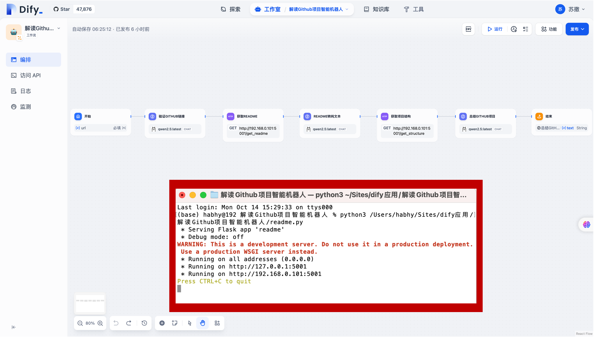

# DifyAIA：Dify AI 工作流与 Flask 工具集

> 一套可导入、可运行、可二次开发的 Dify 工作流示例，覆盖图片识别、网页爬取、文档生成、数据分析和内容自动化。

## 项目简介

本项目将 **Dify 工作流** 与本地 **Flask 服务** 组合起来，把大模型的文本或视觉理解能力转化为可下载、可预览的实际文件。

用户可以直接导入仓库中的 YAML 工作流，也可以参考各子项目，搭建自己的 AI 自动化应用。

> [!IMPORTANT]
> 本仓库基于 [BannyLon/DifyAIA](https://github.com/BannyLon/DifyAIA) 进行兼容性维护与工程化改造。原始工作流及创意归上游作者和相关贡献者所有；使用和再分发时请保留来源说明，并遵循上游仓库的授权要求。

## 核心功能

| 模块 | 主要能力 | 输出结果 | Flask 接口 |
| --- | --- | --- | --- |
| **BillPic2Web** | 上传发票或车票图片，判断票据类型、提取字段并生成报告 | HTML 报告 | `POST /invoice` |
| **DifyWordBridg** | 爬取网页正文，提取标题与内容并生成 Word 文档 | DOCX 文件 | `POST /generate_doc` |
| **Excel_Flask_Dify** | 将自然语言或结构化数据整理为表格 | XLSX 文件 | `POST /create_excel` |
| **DifyMarpFlask_PPT** | 根据主题生成 Marp Markdown，并转换为演示文稿 | PPTX 文件 | `POST /upload` |
| **Mindmap-generate-assistant** | 将 Markdown 内容转换为交互式思维导图 | HTML 思维导图 | `POST /upload` |
| **analysis-Github-project** | 获取 GitHub 仓库 README 和目录结构，辅助大模型分析项目 | 项目分析报告 | `GET /get_readme`、`GET /get_structure` |
| **Dify workflow** | 提供知识库、搜索、翻译、内容生成、票据解析等工作流示例 | Dify 应用 | 导入 YAML DSL |

## 工作方式


项目中的 Dify 工作流负责理解、判断和组织数据；Flask 服务负责文件写入、格式转换和结果返回。两部分可以独立修改，方便替换模型或扩展输出格式。

## 代表性应用

### 1. 发票图片生成 HTML 报告

- 在 Dify 中上传发票、电子车票等图片并选择票据类型。
- 视觉模型判断图片内容与所选类型是否一致。
- 工作流提取金额、日期、票号、乘车信息等字段。
- Flask 将结构化结果保存为 UTF-8 HTML，并返回预览链接。



### 2. 网页内容生成 Word 文档

- 输入网页 URL，由爬虫节点获取页面正文。
- 兼容新版爬虫直接返回 Markdown，以及旧版 JSON 字符串结果。
- 清洗网页标题与正文后调用 Flask 生成 DOCX。
- 接口直接返回文件，避免临时路径失效导致下载失败。



### 3. GitHub 项目分析

- 获取公开仓库的 README 和文件结构。
- 将仓库资料交给模型归纳项目定位、技术栈与核心模块。
- 适合快速阅读开源项目或生成学习笔记。



### 4. 多格式内容生成

- 自然语言或 JSON 数据生成 Excel。
- 主题内容生成 Marp PPT。
- Markdown 生成可交互思维导图。
- 工作流产出的结构化内容可以继续接入其他系统。

## 项目目录

```text
DifyAIA-main/
├─ BillPic2Web/                  # 发票图片识别与 HTML 报告
├─ DifyWordBridg/               # 网页爬取与 Word 文档生成
├─ Excel_Flask_Dify/            # Excel 文件生成
├─ DifyMarpFlask_PPT/           # Marp Markdown 转 PPT
├─ Mindmap-generate-assistant/  # Markdown 转思维导图
├─ analysis-Github-project/     # GitHub 仓库分析
└─ Dify workflow/               # 其他可导入的 Dify YAML 工作流
```

## 快速开始

### 1. 获取项目

```powershell
git clone https://github.com/GMN520/ASL-.git
cd ASL-
```

### 2. 安装常用 Python 依赖

```powershell
python -m pip install flask pandas openpyxl python-docx requests
```

不同子项目使用的依赖不完全相同，可按实际运行的模块安装。

思维导图服务还需要 Node.js：

```powershell
cd Mindmap-generate-assistant
npm install
```

PPT 服务需要安装 Marp CLI：

```powershell
npm install -g @marp-team/marp-cli
```

### 3. 启动所需的 Flask 服务

例如启动 Word 生成服务：

```powershell
python .\DifyWordBridg\Doc_flask_app.py
```

常用默认端口：

| 服务 | 默认端口 |
| --- | ---: |
| Excel | 9000 |
| Marp PPT | 5004 |
| 思维导图 | 5002 |
| BillPic2Web | 5001 |
| DifyWordBridg | 5001 |
| GitHub 项目分析 | 5001 |

多个服务使用相同的 `5001` 端口，请分别启动，或在源码中修改端口后同时运行。

### 4. 导入 Dify 工作流

1. 打开 Dify Studio，新建应用并选择“导入 DSL 文件”。
2. 选择对应项目目录中的 `.yml` 或 `.yaml` 文件。
3. 根据当前 Dify 版本重新选择可用的模型、插件和凭据。
4. 在 HTTP 请求节点中填写 Flask 服务地址。
5. 检查开始节点、文件变量和视觉模型之间的连线后运行工作流。

如果 Dify 运行在 Docker Desktop 中，容器访问宿主机服务时不要使用 `127.0.0.1`，应使用：

```text
http://host.docker.internal:端口/接口
```

例如：

```text
http://host.docker.internal:5001/generate_doc
```

## 兼容性与工程化改进

当前维护版本重点处理了以下实际运行问题：

- 更新部分旧版 Dify 节点的数据传递方式。
- 用爬虫节点替代失效的网页提取能力，并兼容 Markdown 与 JSON 输出。
- 修复视觉模型未绑定上传文件、票据类型判断失效等问题。
- 统一 HTML 和 JSON 的 UTF-8 编码，避免中文报告出现乱码。
- 改进 Word 文件返回方式，避免生成成功但下载阶段报 `WinError 2`。
- 增强 Windows 下 Marp CLI 与 Markmap CLI 的路径解析。
- 将运行目录改为基于脚本位置定位，降低从不同目录启动时的路径错误。
- 清理工作流中的敏感配置，API Key 使用占位符保存。

## 使用注意事项

- 仓库中的 `YOUR_API_KEY` 需要在 Dify 凭据或环境变量中替换，禁止把真实密钥提交到 Git。
- 图片识别节点必须选择支持视觉输入的模型，并把开始节点的文件变量绑定到模型的 Vision 输入。
- Dify 的 SSRF 防护可能拦截本地或私有网络地址。开发环境可使用 `host.docker.internal`、安全的反向代理或经过严格限制的白名单，不建议直接关闭 SSRF 防护。
- ngrok 等临时公网地址会变化，修改地址后需要同步更新 Dify 的 HTTP 请求节点。
- 不同 Dify 版本的节点字段和插件可能不同，导入后应逐节点检查变量映射。
- 生成文件、缓存、密钥和本地环境文件已通过 `.gitignore` 排除。

## 技术栈

- **工作流平台：** Dify
- **后端服务：** Python、Flask
- **数据与文档：** pandas、openpyxl、python-docx
- **内容转换：** Marp CLI、Markmap CLI
- **模型能力：** 大语言模型、视觉语言模型、结构化输出
- **部署与调试：** Docker Desktop、ngrok、HTTP API

## 适合的使用场景

- 学习 Dify 工作流编排和 DSL 文件结构。
- 搭建“模型理解 + 本地文件生成”的 AI 应用。
- 参考多模态图片识别、网页爬取和结构化输出流程。
- 将现有工作流升级到较新的 Dify 版本。
- 作为个人 AI 自动化项目进行二次开发和作品展示。

## 项目来源

- 维护仓库：[GMN520/ASL-](https://github.com/GMN520/ASL-)
- 上游项目：[BannyLon/DifyAIA](https://github.com/BannyLon/DifyAIA)

欢迎通过 Issue 反馈兼容性问题或提交改进建议。
